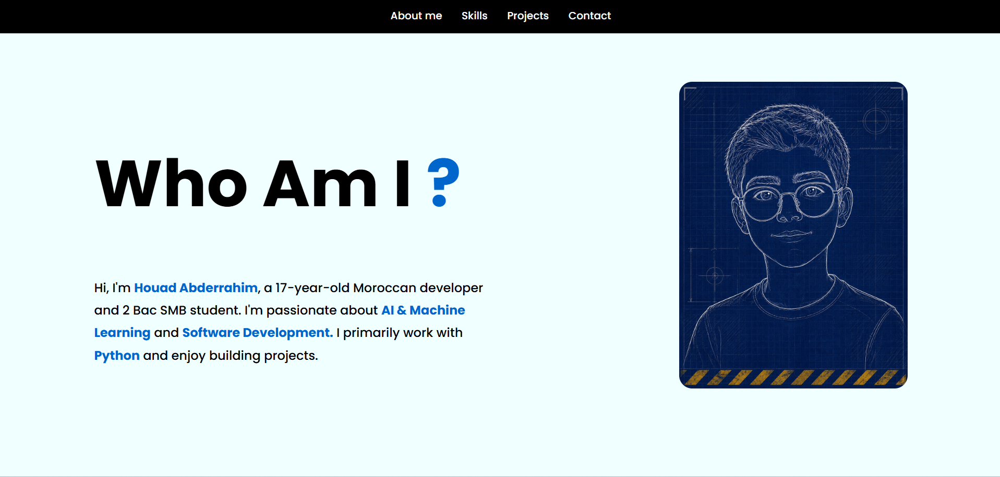
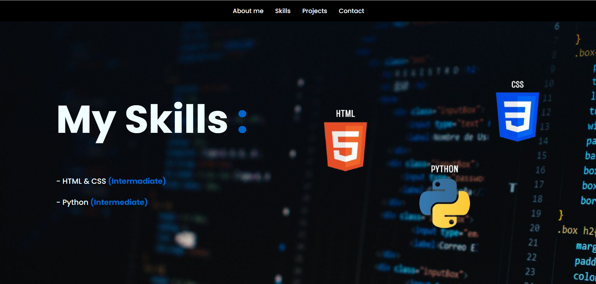
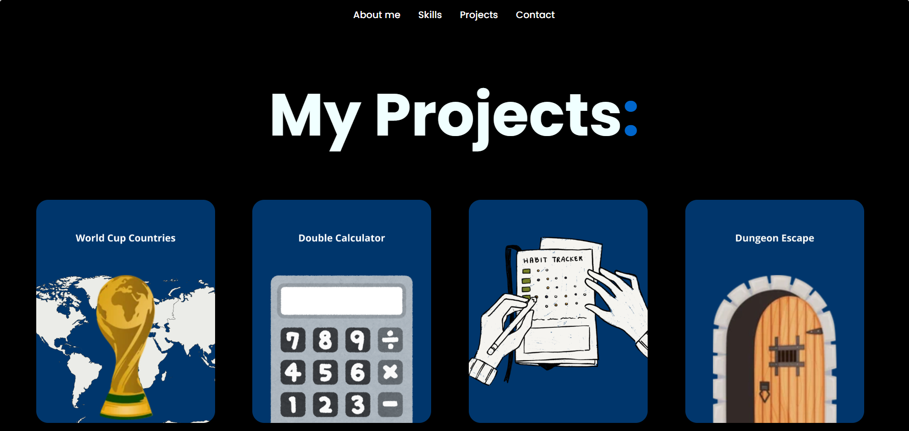
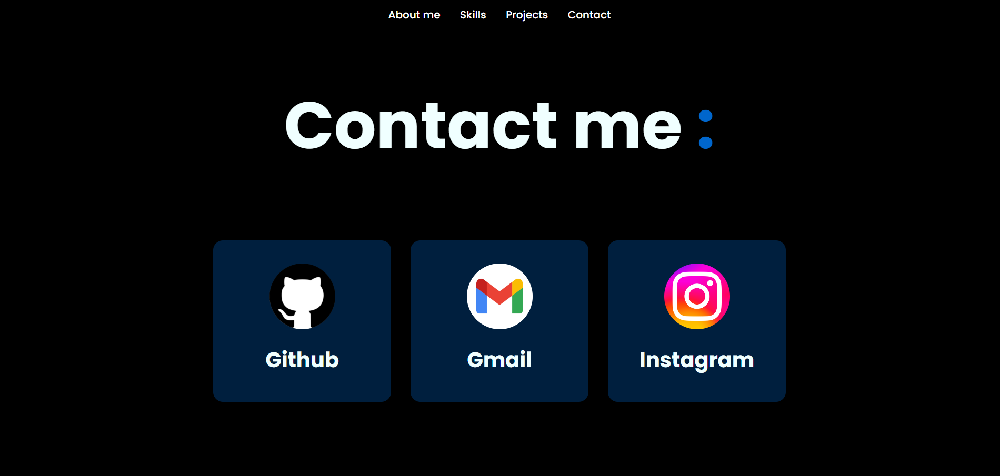
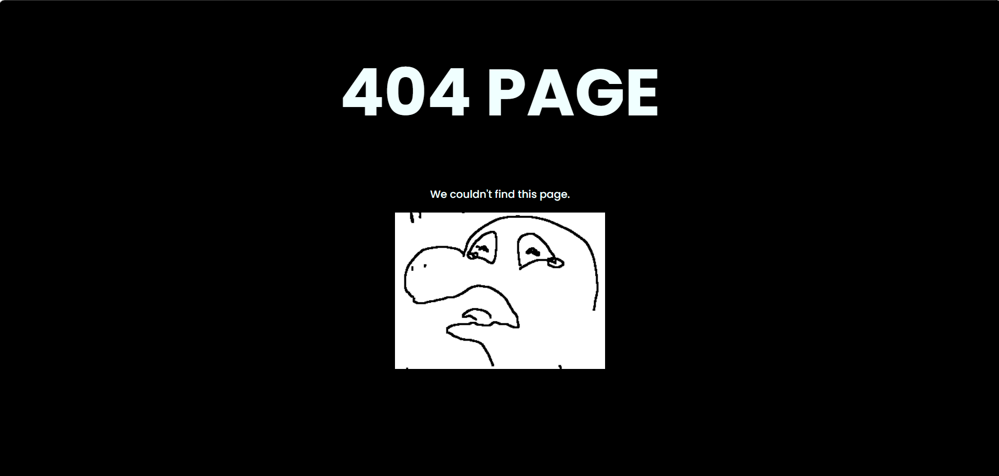

<h1 align="center"> : Website in HTML & CSS & JS</h1>

WCC is an abbreviation for World Cup Countries and it's a website where you open packs to collect all qualified countries for the World Cup. Everything is saved securely in Firebase.

## Table of content

- [Demo](#demo)
  - [About me](#about-me)
  - [Skills](#skills)
  - [Projects](#projects)
  - [Contact](#contact)
  - [404 Page](#404-page)
- [Tech Stack](#tech-stack)
- [Compatibility](#compatibility)
- [AI Usage](#ai-usage)
- [Author](#author)

## Demo

Try it here  → https://xtrawalo.github.io/My-Portfolio

### About me

### Skills

### Projects

### Contact

### 404 Page

## Tech Stack

- HTML & CSS.

## Compatibility

- PC only
- Recommended resolution: **1920×1080**

## AI Usage

This project is my own work. I used Chatgpt only for debugging.

## Author

Me : [xtrawalo](https://github.com/xtrawalo)
